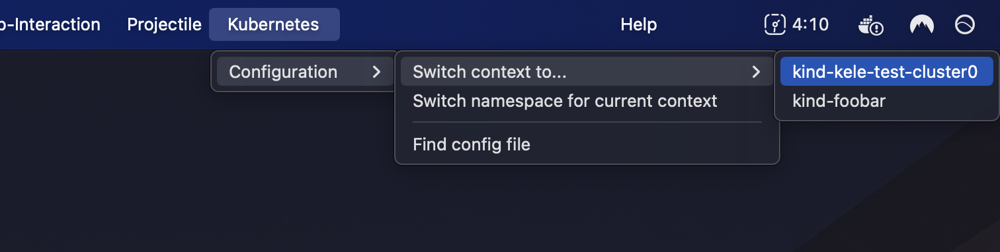

# Integrations

Kele is well-integrated with the Emacs ecosystem.

## Menu Bar

Kele is integrated with the Emacs [menu bar]. The **Kubernetes** section lets
you achieve many of the tasks that you'd normally use keybindings for.

[menu bar]: https://www.gnu.org/software/emacs/manual/html_node/emacs/Menu-Bar.html
