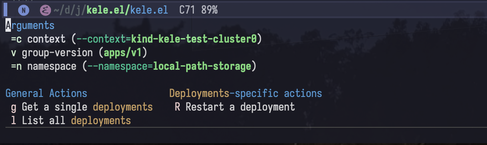
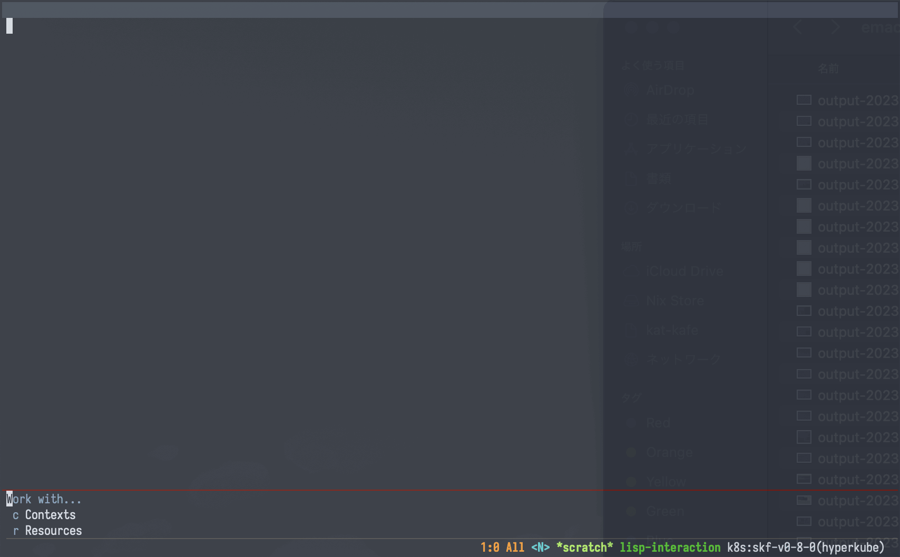
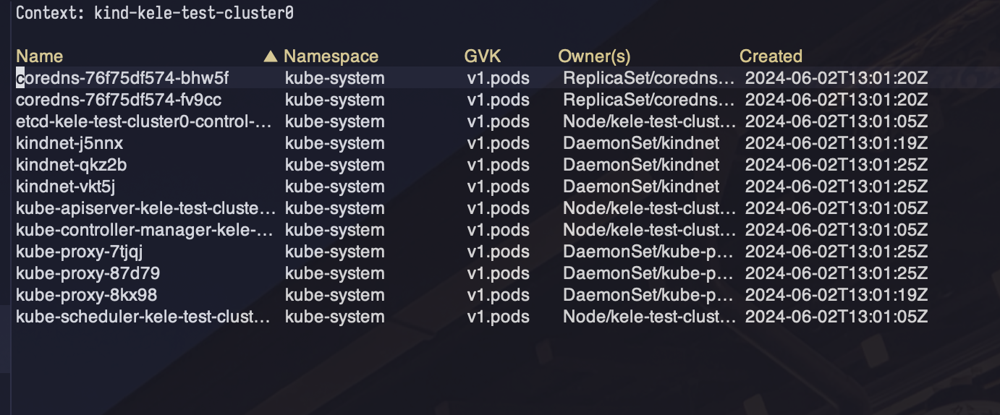
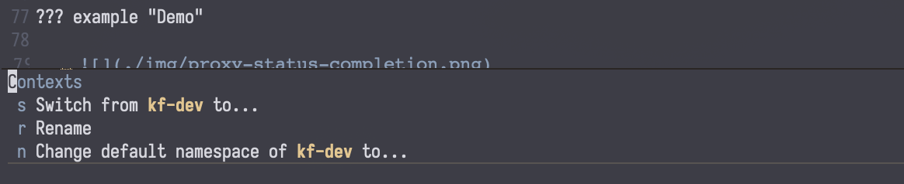

# Usage

!!! note

    You'll notice this page is pretty sparse. Kele is an early-stage package
    with lots of room to grow. Stay tuned for more!

!!! note

    Kele doesn't have a default keybinding prefix for its commands. All examples
    documented here assume that you've opted for `s-k`.

    For instructions on how to set your own keybinding prefix, see: [How-Tos >
    Customization](./customization.md).

## Dispatch

| Keybinding | Interactive function |
|:-----------|:---------------------|
| `s-k ?`    | `kele-dispatch`      |

Kele provides `kele-dispatch` as a launchpad for all subsequent Kele
functionality. If you ever forget what the keybinding is for what you're trying
to accomplish, reach for `kele-dispatch`.

## Working with Resources

`s-k r` will invoke `kele-resource`, allowing you to act on specific resource
kinds. With `kele-resource`, you can, for example:

- Look up a given Kubernetes object by name, fetch its manifest, and display it
  in a separate buffer;
- List out all resources of a given type.



!!! tip inline ""

    `kele-resource` supports [custom resources] too!

!!! note

    Individual bindings within `kele-resource` are enabled/disabled based on
    your permissions in the given cluster. For example, if you do not have `get`
    permission for the given resource, the `g` key will be disabled -- likewise
    the `l` key with `list` permission.

`kele-resource` will first prompt you to select the **kind** that you'd like to
work with, after which you can choose to **get** a specific object of that kind
by name. If the resource is namespaced, you will also be presented with the
option to choose the namespace to select from.

Certain resource kinds have actions unique to them. When you select a resource
kind that has such actions defined, these are presented in a dedicated section
with their own key bindings. For example, `s-k r "deployments"` will, in
addition to the general actions for getting and listing Deployments, also allow
you to restart a specific Deployment.

### Getting a single resource

You can get a single resource of the given kind with:
```
s-k r <kind name> g <resource name>
```

This is bound to `kele-get`.



### Deleting a single resource

You can delete a single resource of the given kind with:
```
s-k r <kind name> d <resource name>
```

### Listing all resources of a single kind

You can list all resources of a single kind with:
```
s-k r <kind name> l
```

This is bound to `kele-list`.



This will list all resources of the specified group-version and kind in a
separate buffer in a table. From here, you can:

- Click any of the header columns to sort the list;
- Click or hit `RET` on any of the entries to display its full manifest in a
  separate buffer;
- Delete a resource with `k`.

!!! tip

    Hitting `RET` with your cursor on the **Owner(s)** column will open the
    **owner resource**.

### Refreshing a resource

You can press `g` in a `kele-get` buffer to re-fetch and refresh the current resource.

## Contexts



Kele commands involving Kubernetes [contexts] center around the `s-k c` prefix (`kele-config`).

| Keybinding | Functionality                         | Interactive function                        | Demo                          |
|:-----------|---------------------------------------|:--------------------------------------------|:------------------------------|
| `s-k c s`  | Switching from one context to another | `kele-context-switch`                       |  |
| `s-k c r`  | Renaming a context                    | `kele-context-rename`                       |  |
| `s-k c d`  | Deleting a context                    | `kele-context-delete`                       |                               |
| `s-k c n`  | Changing the default namespace        | `kele-namespace-switch-for-current-context` |                               |

!!! tip

    Most context-related Kele functionality can also be done via [Embark] on any
    completion candidate in any context-related Kele command.

!!! tip

    If you have functions that need to run after switching to a new context in
    order to use it, `kele-after-context-switch-hook` is available to use. This
    can be useful for, say, re-authenticating with the new context before
    interacting with it.

### Managing proxy servers

Kele allows for starting and stopping [HTTP
proxies](https://kubernetes.io/docs/tasks/extend-kubernetes/http-proxy-access-api/)
for each context. The status of each context's proxy is displayed in the
annotations for each cluster completion candidate.

??? example "Demo"

    

!!! note

    Any proxy server created via Kele is **ephemeral**; they are automatically
    closed and terminated after a set amount of time. For more details, see
    `kele-proxy-ttl`.

!!! note

    Each context can only have one proxy server active at a time. This is an
    artificial limitation put in place by Kele.

| Keybinding | Functionality                                           | Interactive function |
|:-----------|:--------------------------------------------------------|:---------------------|
| `s-k p p`  | Start/stop proxy server process for the current context | `kele-proxy-toggle`  |
| `s-k p P`  | Start/stop proxy server process for a specific context  | `kele-proxy-toggle`  |

[Embark]: https://github.com/oantolin/embark
[custom resources]: https://kubernetes.io/docs/concepts/extend-kubernetes/api-extension/custom-resources/
[contexts]: https://kubernetes.io/docs/tasks/access-application-cluster/configure-access-multiple-clusters/
