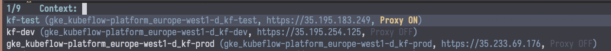

# Usage

!!! note

    You'll notice this page is pretty sparse. Kele is an early-stage package
    with lots of room to grow. Stay tuned for more!

!!! note

    Kele doesn't have a default keybinding prefix for its commands. All examples
    documented here assume that you've opted for `s-k`.

    For instructions on how to set your own keybinding prefix, see: [How-Tos >
    Customization](./customization.md).

## Dispatch

| Keybinding | Interactive function |
|:-----------|:---------------------|
| `s-k ?`    | `kele-dispatch`      |

Kele provides `kele-dispatch` as a launchpad for all subsequent Kele
functionality. If you ever forget what the keybinding is for what you're trying
to accomplish, reach for `kele-dispatch`.

## Working with Resources

### Displaying a single resource

| Keybinding | Interactive function |
|:-----------|:---------------------|
| `s-k r`    | `kele-resource`      |

??? example "Demo"

    

!!! tip inline ""

    `kele-resource` supports [custom resources] too!

`kele-resource` allows you to act on specific resource kinds. With
`kele-resource`, you can retrieve the manifest for a given Kubernetes object and
display it in a separate buffer.

`kele-resource` will first prompt you to select the **kind** that you'd like to
work with, after which you can choose to **get** a specific object of that kind
by name. If the resource is namespaced, you will also be presented with the
option to choose the namespace to select from.

!!! tip ""

    `kele-get` only shows you resource types that support `get`ting in the first
    place.

### Refreshing a resource

You can press `U` in a `kele-get` buffer to re-fetch and refresh the current resource.

## Contexts

!!! tip

    Most context-related Kele functionality can also be done via [Embark] on any
    completion candidate in any context-related Kele command.

Kele commands involving Kubernetes [contexts] center around the `s-k c` prefix (`kele-context`).

| Keybinding | Functionality                         | Interactive function                        | Demo                          |
|:-----------|---------------------------------------|:--------------------------------------------|:------------------------------|
| `s-k c s`  | Switching from one context to another | `kele-context-switch`                       |  |
| `s-k c r`  | Renaming a context                    | `kele-context-rename`                       |  |
| `s-k c n`  | Changing the default namespace        | `kele-namespace-switch-for-current-context` |                               |

### Managing proxy servers

Kele allows for starting and stopping [HTTP
proxies](https://kubernetes.io/docs/tasks/extend-kubernetes/http-proxy-access-api/)
for each context. The status of each context's proxy is displayed in the
annotations for each cluster completion candidate.

??? example "Demo"

    

!!! note

    Any proxy server created via Kele is **ephemeral**; they are automatically
    closed and terminated after a set amount of time. For more details, see
    `kele-proxy-ttl`.

!!! note

    Each context can only have one proxy server active at a time. This is an
    artificial limitation put in place by Kele.

`M-x kele-proxy-start`
: Start a proxy server process for a given context

`M-x kele-proxy-stop`
: Stop a proxy server process for a given context

`M-x kele-proxy-toggle`
: Start or stop a proxy server process for a given context, depending on current status

[Embark]: https://github.com/oantolin/embark
[custom resources]: https://kubernetes.io/docs/concepts/extend-kubernetes/api-extension/custom-resources/
[contexts]: https://kubernetes.io/docs/tasks/access-application-cluster/configure-access-multiple-clusters/
