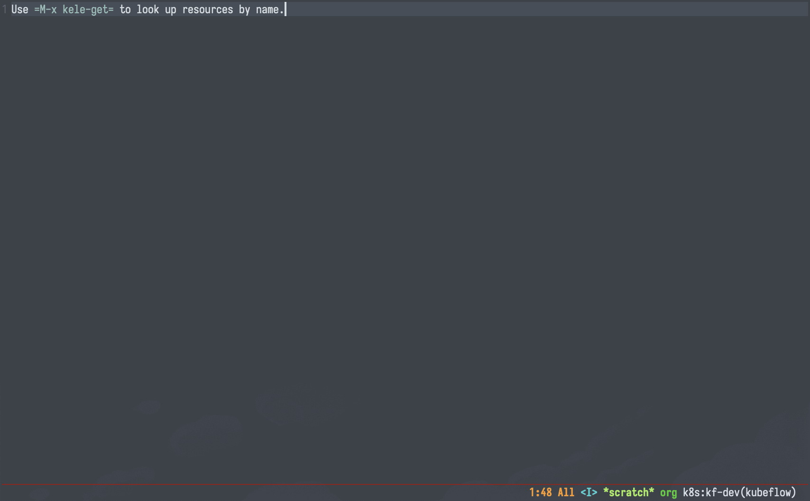

# Usage

!!! note

    You'll notice this page is pretty sparse. Kele is an early-stage package
    with lots of room to grow. Stay tuned for more!

## Working with Resources

### Displaying a single resource

```
M-x kele-get
```

??? example "Demo"

    

!!! tip inline ""

    `kele-get` supports [custom resources] too!

`kele-get` allows you to retrieve the manifest for a given Kubernetes object and
displaying it in a separate buffer. `kele-get` will present you with completion
candidates for:

- The resource kind;
- The group-version (if the same resource kind exists in multiple groups);
- The namespace (if the resource kind is namespaced), and finally;
- The name of the resource itself.

!!! tip ""

    `kele-get` only shows you resource types that support `get`ting in the first
    place.

### Customizing resource display

`kele-get` retrieves the **full** manifest for the requested resource. This may
include "noisy" sub-fields like [`.metadata.managedFields`][managed-fields] or
the [`kubectl.kubernetes.io/last-applied-configuration`
annotation][last-applied-config] that distract from the "important" bits.

You can routinely filter out such fields using the `kele-filtered-fields` custom
variable. For example, to filter out both of the above:

```emacs-lisp
(setq kele-filtered-fields
  '((metadata managedFields)
    (metadata annotations kubectl.kubernetes.io/last-applied-configuration)))
```

## Contexts

### Switching contexts

```
M-x kele-context-switch
```

??? example "Demo"

    

This can also be done via [Embark] on any selection candidate in any other
context-related Kele command, e.g. [`kele-context-rename`](#renaming-a-context).

### Renaming a context

```
M-x kele-context-rename
```

??? example "Demo"

    

This can also be done via [Embark] on any selection candidate in any other
context-related Kele command, e.g. [`kele-context-switch`](#switching-contexts).

### Managing proxy servers

Kele allows for starting and stopping [HTTP
proxies](https://kubernetes.io/docs/tasks/extend-kubernetes/http-proxy-access-api/)
for each context. The status of each context's proxy is displayed in the
annotations for each cluster completion candidate.

??? example "Demo"

    

!!! note

    Any proxy server created via Kele is **ephemeral**; they are automatically
    closed and terminated after a set amount of time. For more details, see
    `kele-proxy-ttl`.

!!! note

    Each context can only have one proxy server active at a time. This is an
    artificial limitation put in place by Kele.

`M-x kele-proxy-start`
: Start a proxy server process for a given context

`M-x kele-proxy-stop`
: Stop a proxy server process for a given context

`M-x kele-proxy-toggle`
: Start or stop a proxy server process for a given context, depending on current status

## Namespaces

### Switching for any context

```
M-x kele-namespace-switch-for-context
```

### Switching for current context

```
M-x kele-namespace-switch-for-current-context
```

[Embark]: https://github.com/oantolin/embark
[custom resources]: https://kubernetes.io/docs/concepts/extend-kubernetes/api-extension/custom-resources/

[managed-fields]: https://kubernetes.io/docs/reference/using-api/server-side-apply/#field-management
[last-applied-config]: https://kubernetes.io/docs/tasks/manage-kubernetes-objects/declarative-config/#how-to-create-objects
