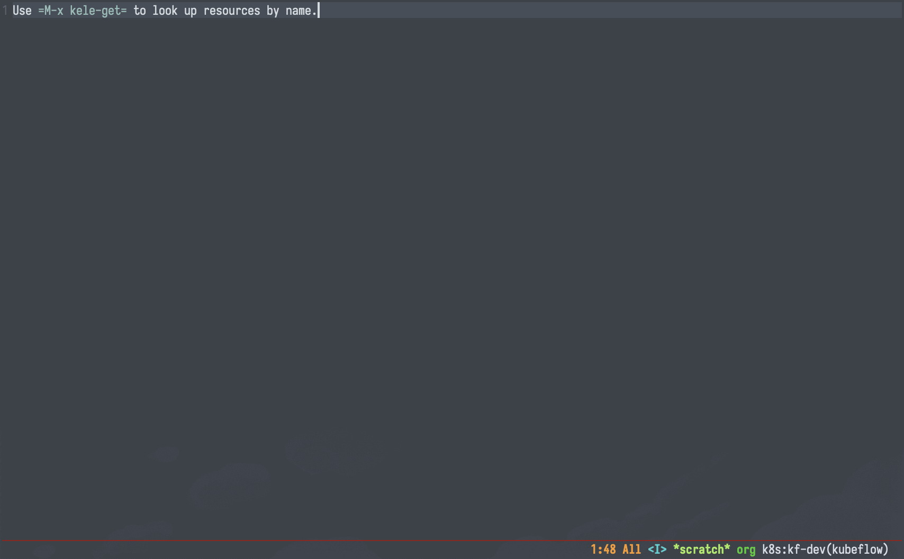
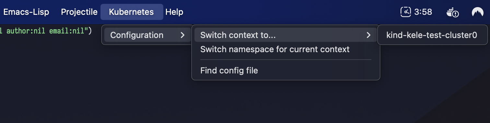
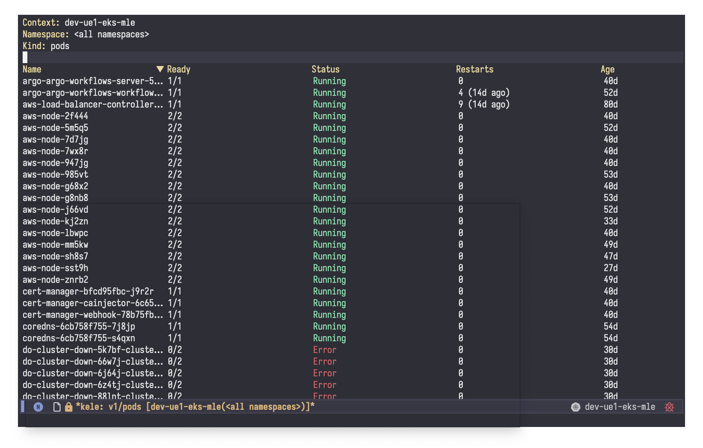

---
hide:
  - navigation
---
# 🥤 kele.el (Kubernetes Enablement Layer for Emacs)

[](https://melpa.org/#/kele)
[](https://stable.melpa.org/#/kele)
[](https://github.com/jinnovation/kele.el/blob/main/LICENSE)

Kele (*kě lè*, or *kə-ˈlə*) ("Kubernetes Enablement Layer for Emacs") is a
Kubernetes cluster management package. It empowers you to perform operations as
coarse or fine-grained as you need, **fast**, and get back to your work.

With Kele, you can:

- Manage [contexts], e.g. [switching, renaming, changing the default
  namespace](./how-tos/usage.md#contexts);
- [Fetch and display the manifest of a single
  resource](./how-tos/usage.md#working-with-resources);
- [List collections of resources](./how-tos/usage.md#working-with-resources);
- Start and stop [proxy servers](./how-tos/usage.md#managing-proxy-servers);
- Use the menu bar to perform basic cluster/config management;
- Add an [interactive modeline indicator](./how-tos/integrations.md#doom-modeline) with
  [`doom-modeline`](https://seagle0128.github.io/doom-modeline/);
- And more! :sunglasses:

See [How-Tos > Usage](./how-tos/usage.md) for more details on what's possible
with Kele.






!!! tip

    To learn more about how Kele compares to some other Kubernetes packages for
    Emacs, see: [Explanations > Comparisons with Similar
    Packages/Tools](./explanations/comparisons.md).

!!! note

    Kele is not an official Kubernetes project.

## Getting Started

!!! warning ""

    Kele requires Emacs 29+.

```emacs-lisp
(use-package kele
  :config
  (kele-mode 1)
  (bind-key (kbd "s-k") kele-command-map kele-mode-map))
```

## Design Ethos

Kele aims to have **PLANS**. Namely, it aims to be:

- **P**erformant: if it is easier/faster for you to simply use `kubectl` to get
  the info you need instead of Kele, then Kele has failed;
- **Lightweight**: minimally intrusive, minimize context-switching, keep
  "embellishments" to a minimum;
- **A**gile: get you the answers you need -- and let you return to your other
  work -- as quickly as possible;
- **N**imble: get you as coarse/detailed insight as needed at any given point,
  with no compromise to any of the other tenets listed here;
- **S**mart: provide sensible defaults and interfaces that "just make sense".

## About the Name

The name Kele comes from the Mandarin term for cola, 可乐 (*kě lè*). It is
also an abbreviation of "Kubernetes Enablement Layer for Emacs."

[Embark]: https://github.com/oantolin/embark
[contexts]: https://kubernetes.io/docs/tasks/access-application-cluster/configure-access-multiple-clusters/
