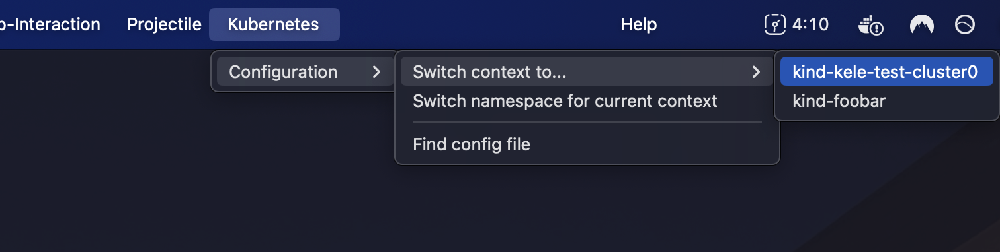

---
hide:
  - navigation
---
# 🥤 kele.el (Kubernetes Enablement Layer for Emacs)

[](https://melpa.org/#/kele)
[](https://stable.melpa.org/#/kele)
[](https://github.com/jinnovation/kele.el/blob/main/LICENSE)

Kele (*kě lè*, or *kə-ˈlə*) ("Kubernetes Enablement Layer for Emacs") is a
Kubernetes cluster management package. It empowers you to perform operations as
coarse or fine-grained as you need, **fast**, and get back to your work.

With Kele, you can:

- Manage [contexts], e.g. [switching, renaming, changing the default
  namespace](./how-tos/usage.md#contexts);
- [Display details](./how-tos/usage.md#working-with-resources), [follow
  logs](./how-tos/usage.md#following-logs), and manage port-forwards for
  resources;
- [List collections of resources](./how-tos/usage.md#working-with-resources);
- Start and stop [proxy servers](./how-tos/usage.md#managing-proxy-servers);
- Use the menu bar to perform basic cluster/config management;
- Add an [interactive modeline indicator](./how-tos/integrations.md#doom-modeline) with
  [`doom-modeline`](https://seagle0128.github.io/doom-modeline/);
- And more! :sunglasses:

See [How-Tos > Usage](./how-tos/usage.md) for more details on what's possible
with Kele.

!!! tip

    To learn more about how Kele compares to some other Kubernetes packages for
    Emacs, see: [Explanations > Comparisons with Similar
    Packages/Tools](./explanations/comparisons.md).

!!! note

    Kele is not an official Kubernetes project.

## Screenshots

=== "End-to-end"

    

=== "Menu bar integration"

    

=== "Resource listing"

    

=== "`doom-modeline` integration"

    

## Getting Started

!!! warning ""

    Kele requires Emacs 29+.

```emacs-lisp
(use-package kele
  :config
  (kele-mode 1)
  (bind-key (kbd "s-k") kele-command-map kele-mode-map))
```

By default this will load the package eagerly. This can be useful if you would
like [modeline integration](./how-tos/integrations.md) to be always present. If,
instead, you'd like to lazily load the package, try the following, which will
only load the package when you invoke the prefix keybinding:

```emacs-lisp
(use-package kele
  :config
  (kele-mode 1)
  :bind-keymap
  ("s-k" . kele-command-map))
```

## About the Name

The name Kele comes from the Mandarin term for cola, 可乐 (*kě lè*). It is
also an abbreviation of "Kubernetes Enablement Layer for Emacs."

[Embark]: https://github.com/oantolin/embark
[contexts]: https://kubernetes.io/docs/tasks/access-application-cluster/configure-access-multiple-clusters/
